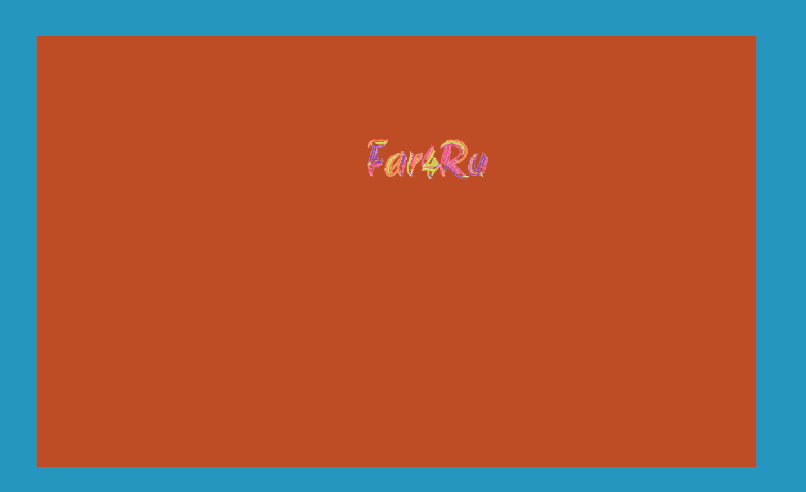

# Приложение с анимацией на PixiJS

[Демонстрация](https://far4ru.github.io/pixijs-animation/)

## Функциональные возможности
- [x] TypeScript;
- [x] фон 1000x600;
- [x] анимация в центре экрана (минимум 400x400, 5 кадров);
- [x] PixiJS v4;
- [x] работа в десктопных браузерах (Mozilla, Chrome, IE11) и в мобильных браузерах (Chrome, Safari, Android Browser);
- [x] масштабирование (scaling) до макс. 1280x768 (в мобильной версии до возможного максимума) по меньшей стороне по центру;
- [x] полноэкранный режим в мобильной версии по нажатию или свайпу.

## Свойства
- [x] ООП, выделение сущностей и объектов;
- [x] динамические/настраиваемые параметры в конфигурационных файлах (например, размер игрового поля).
